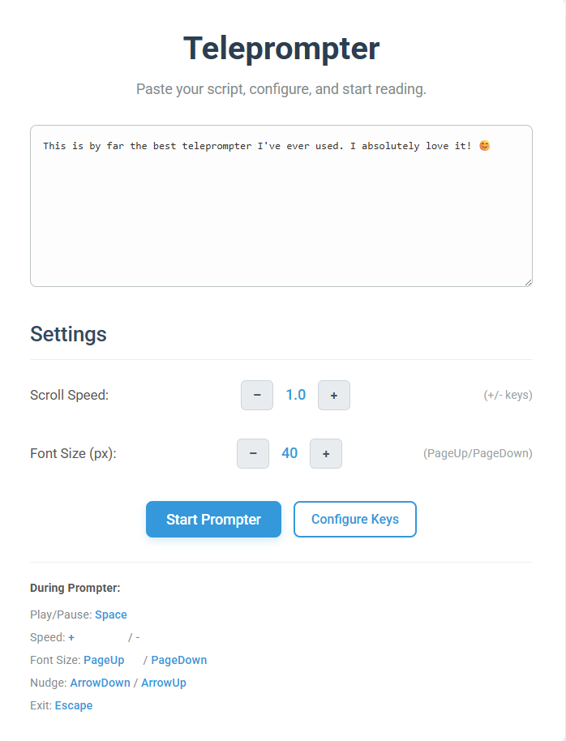
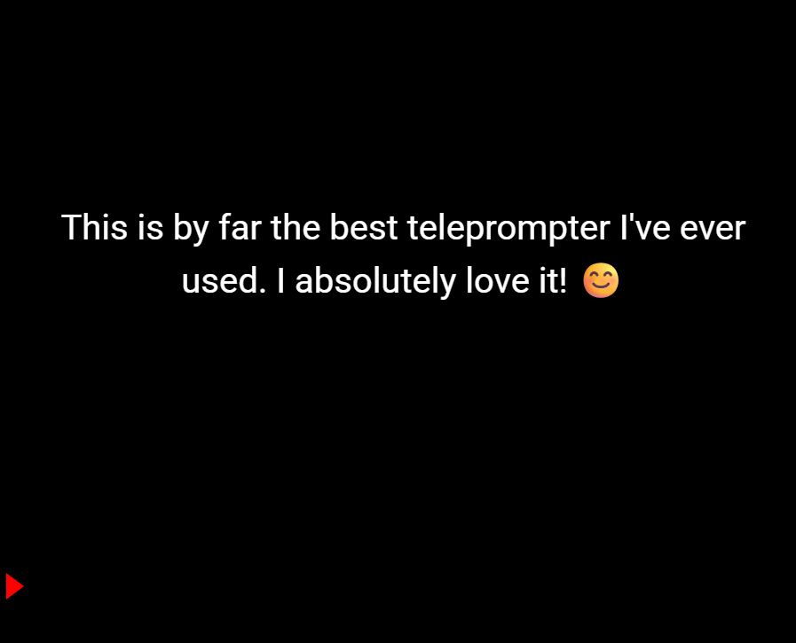

# DBV PWA Teleprompter

 
 

A lightweight, browser-based Progressive Web App (PWA) teleprompter. Paste your text, control speed and font size, and start reading! Works offline after the first visit and can be "installed" on your device.

## ✨ Features

*   **Paste & Go:** Easily paste large amounts of text.
*   **Adjustable Speed:** Control scrolling speed with on-screen buttons or keyboard shortcuts.
*   **Adjustable Font Size:** Customize text size for readability.
*   **Keyboard Controls:**
    *   Play/Pause: `Spacebar` (configurable)
    *   Speed Up/Down: `+` / `-` (configurable)
    *   Font Size Up/Down: `PageUp` / `PageDown` (configurable)
    *   Nudge Text: `ArrowUp` / `ArrowDown` (configurable)
    *   Exit Prompter: `Escape` (configurable)
*   **Configurable Keys:** Customize keyboard shortcuts to your preference (saved in local storage).
*   **PWA Ready:**
    *   Installable on desktop and mobile devices.
    *   Works offline (core app shell).
*   **Modern Interface:** Clean and user-friendly setup screen.
*   **Focus Indicator:** Red triangle to guide your reading during playback.
*   **Responsive Design:** Adapts to different screen sizes.

## 🚀 Live Demo

[**Try it out here!**](https://davidbuenov.github.io/dbv-teleprompter/) <!-- Optional: Link to GitHub Pages demo -->

## 🛠️ Tech Stack

*   HTML5
*   CSS3
*   Vanilla JavaScript
*   Service Worker for PWA capabilities

## ⚙️ Getting Started

**As a User:**

1.  Simply open `index.html` in your web browser.
2.  Or, visit the [live demo link](#-live-demo) above.
3.  **To install as a PWA:**
    *   **Desktop (Chrome/Edge):** Look for an install icon in the address bar.
    *   **Mobile (Android Chrome):** You should be prompted to "Add to Home Screen" after a few interactions.
    *   **Mobile (iOS Safari):** Tap the "Share" icon, then "Add to Home Screen."

**For Local Development:**

1.  Clone the repository:
    ```bash
    git clone https://github.com/[YourGitHubUsername]/[YourRepositoryName].git
    ```
2.  Navigate to the project directory:
    ```bash
    cd [YourRepositoryName]
    ```
3.  Open `index.html` in your browser.
    *   For PWA features like the service worker to function correctly during local development, you might need to serve the files via a local web server (e.g., using the `http-server` npm package or a browser extension like "Live Server" for VS Code). `localhost` is treated as a secure origin.

## 📜 How to Use

1.  **Paste Text:** Copy your script and paste it into the large text area on the setup screen.
2.  **Adjust Settings:**
    *   Use the `+` / `-` buttons or keyboard shortcuts to set the desired **Scroll Speed**.
    *   Use the `+` / `-` buttons or keyboard shortcuts to set the desired **Font Size**.
3.  **Configure Keys (Optional):** Click "Configure Keys" to customize the keyboard shortcuts for various actions. Your preferences will be saved in your browser.
4.  **Start Prompter:** Click the "Start Prompter" button.
5.  **During Playback:**
    *   Use your configured keys to play/pause, adjust speed/font, nudge the text, or exit.
    *   The red triangle on the left indicates the approximate reading line.

## 🙏 Acknowledgements

This project was developed by **[David Bueno Vallejo/davidbuenov]**.

Significant portions of the code, including the core logic for the teleprompter, PWA implementation, user interface design, and iterative improvements, were generated and refined with the assistance of **Google's AI (Gemini 2.5 Pro Preview 05-06)**. This was a collaborative effort where the AI provided code generation, debugging help, and architectural suggestions.

## 📄 License

This project is licensed under the MIT License - see the [LICENSE](LICENSE) file for details.

---

*Made with ❤️ and a little help from AI!*
