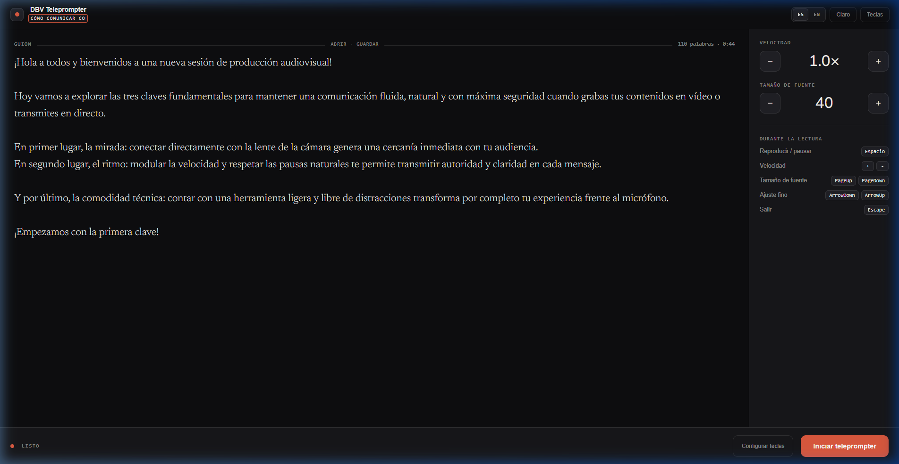
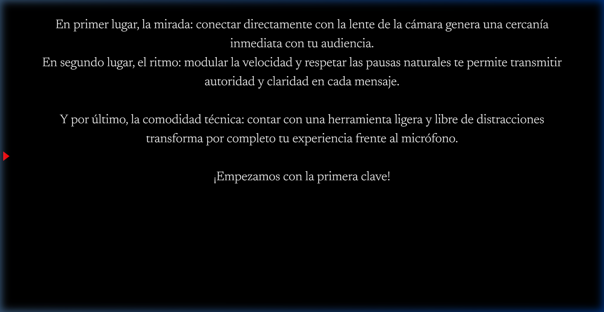

# DBV Teleprompter




A lightweight, professional teleprompter designed with a **Studio Instrument** interface for video creators, presenters, and streamers. Available both as a modern browser-based Progressive Web App (PWA) and as a standalone native desktop application for Windows, macOS, and Linux.

---

## ✨ Features

- 🎛️ **Studio Instrument Interface:** Sleek matte-black aesthetic designed for studio environments with fluid layout, custom slim scrollbars, and distraction-free dark/light themes.
- 🌐 **Full Bilingual Support (i18n):** Instant switching between **Español** and **English** with reactive translations for labels, statistics, toasts, and shortcut keys.
- 📁 **Native File Management & Interactive Title:**
  - Open and import `.txt` and `.md` script files with native OS file choosers (`rfd` in desktop, File System Access API in browser).
  - Save and export scripts with customizable script titles.
  - Full **Drag & Drop** support to drop text files directly onto the script editor.
- ⏱️ **Real-Time Word Count & Speech Duration:** Dynamic calculation of word count and estimated reading time based on your selected scroll speed.
- ⌨️ **Universal Desktop Shortcuts:**
  - `⌘S` / `Ctrl+S`: Save script to file.
  - `⌘O` / `Ctrl+O`: Open script file.
  - `⌘Enter` / `Ctrl+Enter`: Start teleprompter instantly.
  - `Space`: Pause / Resume scrolling.
  - `+` / `-`: Increase / Decrease scroll speed.
  - `PageUp` / `PageDown`: Increase / Decrease font size.
  - `↑` / `↓`: Nudge text forward / backward.
  - `Escape`: Exit teleprompter to setup or close key configuration panel.
- ⚙️ **Configurable Keyboard Shortcuts:** Slide-in settings panel to customize every control key to your personal preference (persisted in local storage).
- 🎯 **Focus Reading Guide:** Contrast indicator line to keep your eye line aligned during playback.
- 🔒 **100% Offline & Private:** Zero external CDN dependencies, self-hosted brand fonts (`Newsreader` and `Nunito`), and no telemetry. Your scripts never leave your machine.

---

## 🚀 Live Web Demo & PWA

[**Launch Web Teleprompter**](https://davidbuenov.github.io/dbv-teleprompter/)

### Install as a PWA:
- **Desktop (Chrome / Edge / Brave):** Click the install icon in the address bar.
- **Mobile (Android):** Tap "Add to Home screen".
- **Mobile (iOS Safari):** Tap the Share button → "Add to Home Screen".

---

## 🖥️ Desktop Application (Windows, macOS, Linux)

Download pre-compiled native installers directly from the [Releases Page](https://github.com/davidbuenov/dbv-teleprompter/releases):

- **Windows:** `.exe` (NSIS Installer) / `.msi`
- **macOS:** `.dmg` / `.app.tar.gz` (Universal Apple Silicon + Intel)
- **Linux:** `.deb` / `.AppImage`

> *Note for macOS / Windows without commercial certificate:* If prompted by SmartScreen or Gatekeeper on first launch, select *"More info" → "Run anyway"* (Windows) or Right Click → *"Open"* (macOS).

---

## 🛠️ Tech Stack

- **Frontend:** Vanilla HTML5, CSS3 Custom Properties, Vanilla JavaScript (zero bundler, fast IIFE architecture).
- **Offline / PWA:** Dedicated Service Worker (`sw.js`) and Web App Manifest.
- **Desktop Core:** [Tauri v2](https://v2.tauri.app/) (Rust) with native menus and `rfd` dialogs.
- **Spec-Driven Architecture:** `dbv-specs-ops` framework.

---

## ⚙️ Local Development

### Prerequisites
- [Node.js](https://nodejs.org/) (v20+)
- [Rust](https://www.rust-lang.org/tools/install) (for desktop builds)

### Quick Start

1. **Clone the repository:**
   ```bash
   git clone https://github.com/davidbuenov/dbv-teleprompter.git
   cd dbv-teleprompter
   ```

2. **Web Mode:**
   Open `index.html` in your browser or run a simple local server:
   ```bash
   python -m http.server 8080
   ```

3. **Desktop Mode (Tauri):**
   ```bash
   npm install
   npm run tauri dev      # Launch desktop app with live reload
   npm run tauri build    # Compile release installer for your OS
   ```

---

## 📄 License

This project is licensed under the MIT License - see the [LICENSE](LICENSE) file for details.

Developed with ❤️ by **[David Bueno Vallejo](https://davidbuenov.com)** · [GitHub](https://github.com/davidbuenov)

